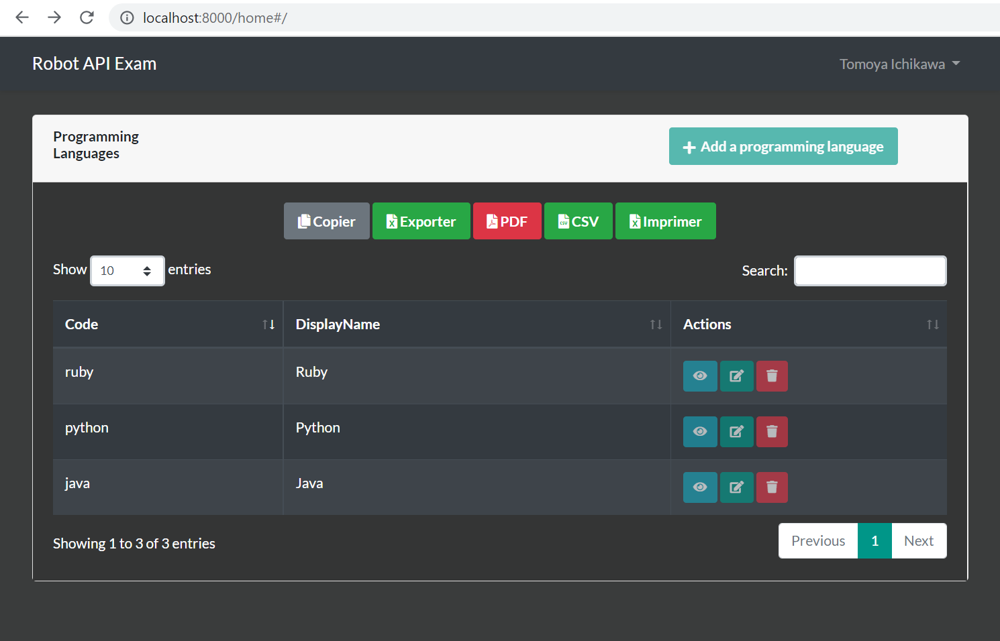

# Robot API Exam Client (Laravel & Vue.JS)
### Full Stack Application
Built with these technologies
<table>
    <tr>
        <td>
            
        </td>
        <td>
            
        </td>
        <td>
            
        </td>
    </tr>
</table>

## Dashboard (Client)

## Requirements
You need to have PHP version **7.3** or above. Node.js version **12.0** or above.

## Installation

#### Backend
1. Clone the project | *Cloner le projet*
2. Go to the project directory | *Se positionner dans le répertoire du projet*
3. Run `composer install` | *Exécuter `composer install`*
4. Migrate database | *Migrer la base de données*
`php artisan migrate:fresh`
5. Run `php artisan serve` to start the project at http://localhost:8000 | *Exécuter `php artisan serve` pour démarrer le project sur http://localhost:8000*
6. Sign up/Sign in to access dashboard and enjoy the result :) | *S'inscrire/Se connecter pour accéder au tableau de bord et apprécier le résultat :)*

Feel free to contact me if you have any issues
 
*N'hésitez pas à me contacter si vous rencontrez des problèmes*

## License

The project is open-sourced software licensed under the [MIT license](https://opensource.org/licenses/MIT).

